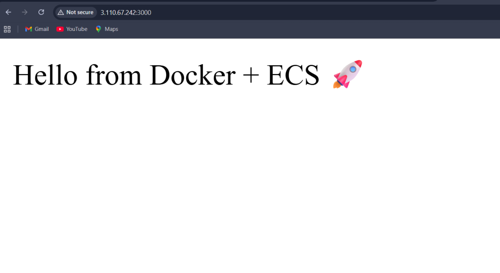

# 🚀 Containerized Node.js Application

## 📌 Overview
This project demonstrates how to containerize a Node.js application using Docker and deploy it on AWS using Amazon ECR and Amazon ECS. The application is packaged into a Docker container, pushed to Amazon Elastic Container Registry (ECR), and deployed as a scalable containerized service using Amazon ECS.

---

## 🎯 Purpose
To deploy and manage a Node.js application in containers using Docker and AWS container services.

---

## 🧰 AWS Services Used
- Amazon ECR (Elastic Container Registry)
- Amazon ECS (Elastic Container Service)
- Amazon EC2
- Docker
- Node.js

---

# ⚙️ Architecture Workflow

```text
Node.js Application
        │
        ▼
Docker Container
        │
        ▼
Amazon ECR Repository
        │
        ▼
Amazon ECS Cluster
        │
        ▼
Containerized Node.js Application Running on AWS
```

---

# 📌 Project Overview
This project demonstrates modern cloud-native deployment by containerizing a Node.js application using Docker and deploying it to AWS using Amazon ECS and Amazon ECR.

---

# 🚀 Features
- Dockerized Node.js Application
- Container Image Storage using Amazon ECR
- Container Deployment using Amazon ECS
- Scalable Cloud-native Architecture
- Simplified Application Deployment

---

# 🔄 How It Works

1. Create Node.js application  
2. Build Docker image  
3. Push Docker image to Amazon ECR  
4. Create ECS Cluster and Task Definition  
5. Deploy containerized application using ECS Service  
6. Access application through ECS public endpoint  

---

# 🛠️ Step-by-Step Setup

## 1️⃣ Create Node.js Application

Example:

```javascript
const express = require('express');
const app = express();

app.get('/', (req, res) => {
    res.send('Node.js App Running on ECS');
});

app.listen(3000, () => {
    console.log('Server running on port 3000');
});
```

---

## 2️⃣ Create Dockerfile

```dockerfile
FROM node:18

WORKDIR /app

COPY package*.json ./

RUN npm install

COPY . .

EXPOSE 3000

CMD ["node", "app.js"]
```

---

## 3️⃣ Build Docker Image

```bash
docker build -t nodejs-app .
```

---

## 4️⃣ Create Amazon ECR Repository

```bash
aws ecr create-repository --repository-name nodejs-app
```

---

## 5️⃣ Push Docker Image to ECR

```bash
docker tag nodejs-app:latest <account-id>.dkr.ecr.<region>.amazonaws.com/nodejs-app

docker push <account-id>.dkr.ecr.<region>.amazonaws.com/nodejs-app
```

---

## 6️⃣ Create ECS Cluster
- Open Amazon ECS
- Create Cluster
- Select EC2 or Fargate launch type

---

## 7️⃣ Create Task Definition
- Add container details
- Use ECR image URI
- Configure CPU and memory

---

## 8️⃣ Deploy ECS Service
- Create ECS Service
- Attach Task Definition
- Set desired task count

---

# 📸 Screenshots

## 🐳 Docker Image Build
(Add Docker build screenshot)

---

## 📦 Amazon ECR Repository
(Add ECR repository screenshot)

---

## ⚙️ ECS Cluster
(Add ECS cluster screenshot)

---

## 🚀 ECS Service Running
(Add ECS service screenshot)

---

## 🌐 Node.js Application Output


---

# 📂 Project Structure

```text
containerized-nodejs-application/
│── screenshots/
│   ├── docker_build.png
│   ├── ecr_repository.png
│   ├── ecs_cluster.png
│   ├── ecs_service.png
│   └── application_output.png
│
│── app.js
│── package.json
│── Dockerfile
│── README.md
```

---

# 💡 Key Features
- Containerized Deployment
- Scalable Cloud Architecture
- Docker-based Packaging
- ECS Container Orchestration
- Simplified Application Management

---

# 🧠 Learning Outcomes
- Understanding Docker Containers
- Working with Amazon ECR
- Deploying Applications on Amazon ECS
- Container Orchestration Concepts
- Cloud-native Application Deployment

---

# 🔮 Future Improvements
- Add Application Load Balancer
- Use ECS Fargate
- Configure Auto Scaling
- Add CI/CD using GitHub Actions
- Add CloudWatch Monitoring

---

# 👩‍💻 Author
**Nitisha Mali**

GitHub: [Nitisha-hub](https://github.com/Nitisha-hub)
